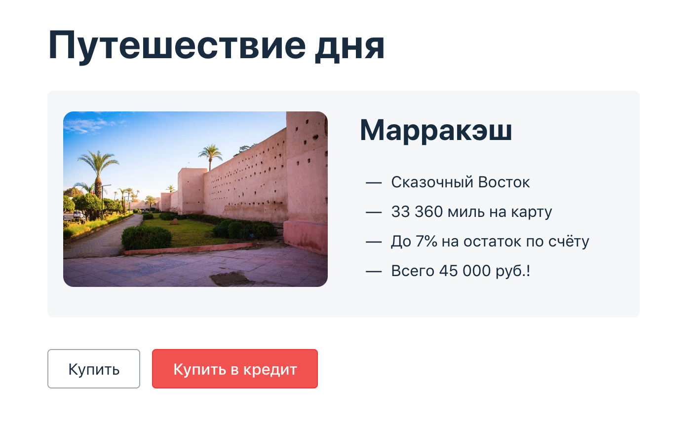

# Дипломный проект по профессии «Тестировщик»

Дипломный проект — автоматизация тестирования комплексного сервиса, взаимодействующего с СУБД и API платежной системы.

## 📋 Содержание

- [Требования](#требования)
- [Установка и настройка](#установка-и-настройка)
- [Запуск тестов](#запуск-тестов)
- [Запуск отдельных тестов](#запуск-отдельных-тестов)
- [Генерация Allure отчетов](#генерация-allure-отчетов)

## 🚀 Требования

Перед запуском убедитесь, что установлено следующее ПО:

| ПО | Версия | Команда для проверки |
|---|---|---|
| **Docker Desktop** | 20.10+ | `docker --version` |
| **Docker Compose** | 2.0+ | `docker-compose --version` |
| **Python** | 3.11+ | `python --version` |
| **Git** | 2.30+ | `git --version` |
| **Allure**  | 2.20+ | `allure --version` |
| **Google Chrome** | последняя версия | - |

## 🛠 Установка и настройка
### 1. Клонирование репозитория
  - `git clone <url-репозитория>`
  - `cd <директория-проекта>`
### 2. Запуск тестируемого приложения через Docker 
  - Запуск всех сервисов
     - `docker-compose up -d`
   - Проверка статуса контейнеров 
     - `docker-compose ps`
   - Ожидание полного запуска (20-30 секунд)
   - Приложение будет доступно по адресу: http://localhost:8080
     
### 3. Создание виртуального окружения Python
  ###### Windows
powershell (Здесь и далее для Windows команды выполняются в терминале)
  - `python -m venv venv`
  - `venv\Scripts\activate`
  ###### macOS/Linux
  - `python3 -m venv venv`
  - `source venv/bin/activate`
### 4. Установка зависимостей
  - `pip install --upgrade pip`
  - `pip install -r requirements.txt`
### 5. Настройка переменных окружения

Создайте файл `.env` в корне проекта:

```env
# URL тестируемого приложения
APP_URL=http://localhost:8080

# Настройки базы данных
DB_HOST=localhost
DB_PORT=3307
DB_USER=app_user
DB_PASSWORD=app_pass
DB_NAME=app_db

# Приложение
APP_URL=http://localhost:8080

# Gate Simulator
GATE_URL=http://localhost:9999

# Тестовые карты (из data.json)
CARD_APPROVED=4444444444444441
CARD_DECLINED=4444444444444442
```
### 6. Проверка готовности окружения
- Проверка доступности приложения
   - `curl http://localhost:8080`
- Проверка доступности базы данных
- `docker exec -it mysql-db mysql -u app_user -papp_pass -e "SELECT 1" app_db`
 

Если всё настроено верно, приложение подключится к БД и эмулятору, и вы сможете тестировать платежи.

## 🧪 Запуск тестов
### - Запуск всех тестов
  - Базовый запуск
    - `pytest tests/ -v`
  - Запуск с выводом print (для отладки)
      - `pytest tests/ -v -s`
  - Запуск с Allure
    - `pytest tests/ --alluredir=allure-results --clean-alluredir -v`
### - Запуск по группам
   - Только тесты оплаты
     - `pytest tests/test_payment.py -v`
    - Только тесты кредита
      - `pytest tests/test_credit.py -v`
    - Только тесты БД
      - `pytest tests/test_database.py -v`
  - Только позитивные тесты
    - `pytest tests/ -k "POS" -v`
  - Только негативные тесты
  - `pytest tests/ -k "NEG" -v`
 ## 🎯  Запуск отдельных тестов
 ### - По имени теста
    - Конкретный тест в конкретном файле
      - `pytest tests/test_payment.py::TestPayment::test_successful_payment -v`
    - Тест кредита с отклоняемой картой
      - `pytest tests/test_credit.py::TestCredit::test_declined_credit -v -s`
### - По ключевым словам
    - Все тесты со словом "declined"
      - `pytest tests/ -k "declined" -v`
  - Все тесты оплаты со словом "successful"
  - `pytest tests/test_payment.py -k "successful" -v`
 ## 📊 Генерация Allure отчетов
  Полный цикл (запуск + отчет)
  
### 1. Запуск тестов с сохранением результатов
`pytest tests/ --alluredir=allure-results --clean-alluredir -v`
### 2. Генерация HTML отчета
`allure generate allure-results -o allure-report --clean`
### 3. Открытие отчета в браузере
`allure open allure-report`


